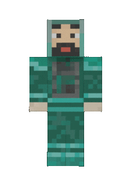

# Hi, I'm Rupesh 👋🏻👨🏻‍💻

<!--  -->

## 👨🏻‍💻 &nbsp;About Me

🎓 &nbsp;I'm currently studying Computer Engineering at Pune Institute of Computer Technology, Pune.\
💡 &nbsp;Some technologies I enjoy working with include C++, Python, ReactJS, JavaScript, NodeJS and ExpressJS. Currently exploring full stack web development tools.\
🌱 &nbsp;I'm on track for learning more about Computer Networks, Operating Systems, and Algorithms.\
✉️ &nbsp;You can shoot me an email at rupeshdharme200001@gmail.com! I'll try to respond as soon as I can.

## Find me around the web 🌎 

<!--  -->

- Struggling on <a href="https://leetcode.com/rupesh_dharme/">LeetCode</a> 😍
- Competing on <a href="https://www.codechef.com/users/rupesh_dharme">CodeChef</a> 🙃
- Sharing updates on <a href="https://www.linkedin.com/in/rupeshdharme/">LinkedIn</a> 😇

## Watch my contributions get eaten by a snake 🐍

<!--  -->

## Technologies

### Programming and Scripting languages

  
  
  
  
  
  

### Libraries and Frameworks

  <!--  -->
  
  <!--  -->
  
  <!-- 
  
  
   -->
  
  <!--  -->
  
  
  <!-- 
  
  
  
  

 -->

### Databases

  
  <!--  -->
  
  <!--  -->

## Github stats

## Contact me

 

 

---

Made with ❤️ by Rupesh Dharme 

